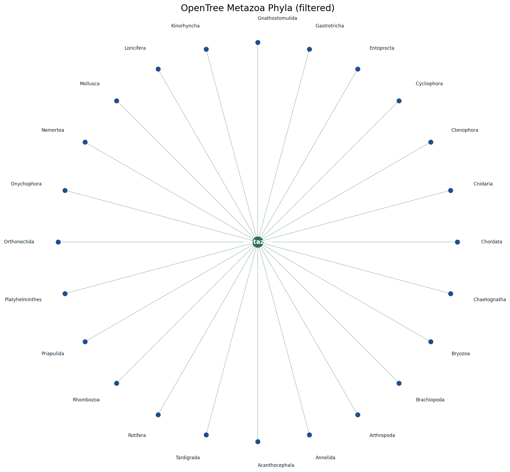
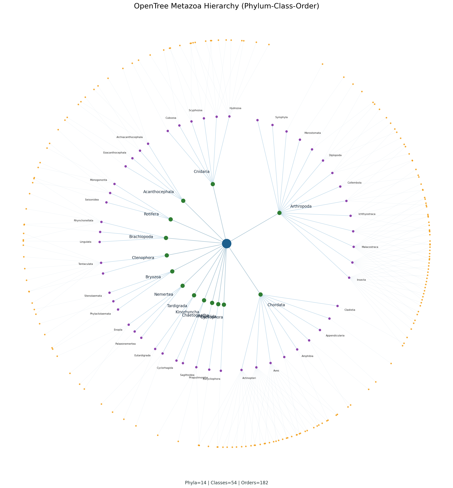

# AnimaliaEcon

AnimaliaEcon is an open, machine-readable dataset and reproducible pipeline for estimating economic-game priors across Animalia.

## Core direction
- Taxon-first priors: build robust priors at higher ranks first (`phylum`, `class`, `order`, `family`)
- Deterministic waterfall baseline: estimate deterministic priors at higher ranks, then blend down to species
- Coverage expansion by clade: auto-expand candidate species lists with per-row confidence scoring
- Optional species inheritance: species can inherit from the nearest modeled taxon rank
- AWS-first AI inference: use Amazon Bedrock models (including Anthropic Claude on Bedrock)
- Formal hierarchical Bayesian pooling across taxonomy with propagated posterior uncertainty
- Full Bayesian inference path (PyMC NUTS) with posterior predictive checks and diagnostics artifacts
- Clade-level calibration to known behavioral-study anchors
- Evidence bundles for species/taxon rows (citations, notes, AI rationale hashes)
- Strict output validation: processed datasets are schema-checked in pipeline targets

## Animalia Labs
Explore interactive demos and future hosted tools at [AnimaliaLabs.com](https://animalialabs.com). The goal there is to let users query taxa, inspect priors, and run game simulations in-browser.

## Quickstart
```bash
python3 -m venv .venv
source .venv/bin/activate
pip install -r requirements.txt

# Optional AI refinement via Bedrock (Claude/Nova/etc.)
export AWS_REGION=us-east-1
export BEDROCK_MODEL_ID=us.amazon.nova-lite-v1:0

make pipeline
# or, if Bedrock credentials/model access are ready:
make pipeline-ai
# force complete AI recompute:
make pipeline-ai-full
#
# validate outputs only:
make validate-data
# regenerate API contract schemas:
make api-schema
# enforce contract snapshot cleanliness:
make contract-check
# temporal/versioned priors + drift reports:
make prior-history
# simulation realism benchmark suite:
make benchmark-sim

# Simulate from taxon priors (default dataset)
python -m sim.cli risk-choice --entity Mammalia --rank class
python -m sim.cli public-goods --entity Corvidae --rank family

# Optional species simulation using inherited dataset
python -m sim.cli trust --entity "Pan troglodytes" --entity-kind species --dataset data/processed/animaliaecon_species_inherited.csv

# run read-only API locally
uvicorn api.main:app --reload --host 0.0.0.0 --port 8000
# or:
make api-dev
```

## Pipeline outputs
- `data/processed/animaliaecon_taxon_priors.csv`: primary release dataset (taxon-first)
- `data/processed/animaliaecon_species_inherited.csv`: optional species priors inherited from taxon estimates
- `data/processed/animaliaecon_species_observed.csv`: species-level posteriors from current seed evidence
- `data/processed/animaliaecon_evidence_species.csv`: species evidence bundle (citations + rationale hashes)
- `data/processed/animaliaecon_evidence_taxon.csv`: taxon evidence bundle aggregated from species evidence
- `data/interim/species_overrides_audit.csv`: audit trail of applied species overrides
- `data/interim/taxon_overrides_audit.csv`: audit trail of applied taxon overrides
- `data/interim/calibration_audit.csv`: audit trail of clade-level calibration operations
- `data/interim/bayes_model_diagnostics.csv`: Bayesian diagnostics summary
- `data/interim/bayes_posterior_predictive_checks.csv`: posterior predictive checks
- `data/curation/species_override_review_queue.csv`: low-confidence exception queue for manual curation
- `data/processed/animaliaecon_taxon_priors_history.csv`: release-by-release taxon prior history
- `data/processed/animaliaecon_species_observed_history.csv`: release-by-release species prior history
- `data/processed/animaliaecon_prior_drift_detail.csv`: per-entity per-parameter release deltas
- `data/processed/animaliaecon_prior_drift_summary.csv`: drift summary aggregates by release/parameter

## Adding animals (seed vs wishlist)
- `data/seeds/species_seed.csv` is the committed baseline set that always enters the pipeline.
- `data/seeds/species_candidate_bank.csv` is the wishlist/candidate pool used to fill clade targets.
- `data/seeds/target_clades.csv` controls how many species to include per target clade (`target_n`).
- `pipeline/expand_species_candidates.py` pulls from the candidate bank when a target clade is below `target_n`.
- `data/interim/species_expansion_coverage.csv` reports target coverage and shortfalls after expansion.

Quick workflow:
1. Add new wishlist rows to `data/seeds/species_candidate_bank.csv`.
2. Increase clade targets in `data/seeds/target_clades.csv` if you want larger cohorts.
3. Run `make pipeline` (or `make pipeline-ai`) and check `data/interim/species_expansion_coverage.csv`.

## Manual Curation Layer
Domain experts can override modeled priors via:
- `data/curation/species_overrides.csv`
- `data/curation/taxon_overrides.csv`
- `data/curation/species_override_review_queue.csv` is auto-generated to focus manual work on low-confidence/high-uncertainty exceptions.

Overrides are applied automatically in `make pipeline`, `make pipeline-ai`, and `make pipeline-ai-full`.

## API Service
This repo includes a read-only API to serve priors and simulation endpoints.

Core endpoints:
- `GET /v1/taxon-priors`
- `GET /v1/taxon-priors/{rank}/{taxon}`
- `GET /v1/species-priors/{species}`
- `GET /v1/species/search`
- `GET /v1/species/by-id/{id}`
- `GET /v1/species/random`
- `POST /v1/simulate`
- `GET /v1/snapshots` + `/v1/snapshots/{dataset_version}/...` immutable snapshot endpoints

Most read endpoints support dataset pinning with `?dataset_version=<version>`.

Service contract is stabilized via `/v1` schemas in `schema/api/v1/` and the `X-API-Contract-Version` response header.

## Dataset Releases
Create versioned snapshots with checksums and changelog entries:

```bash
make release-dataset VERSION=0.3.0 NOTES="Taxon prior refresh"
make release-dataset-tag VERSION=0.3.0 NOTES="Taxon prior refresh"
```

## OpenTree Taxonomy Backbone
We use OpenTree taxonomy (Metazoa/Animalia branch) as the canonical hierarchy.

```bash
# Resolve latest OTT release only (no download)
make taxonomy-meta

# Download latest OTT taxonomy, extract Metazoa subtree, map phyla, render snapshot
make taxonomy-refresh
```

Key outputs:
- `data/processed/opentree_release_metadata.json`: resolved OTT release + archive metadata
- `data/processed/opentree_metazoa_phyla.csv`: filtered phylum mapping under Metazoa
- `data/interim/opentree/metazoa_subtree_nodes.csv`: extracted subtree nodes with paths
- `docs/assets/metazoa_phyla_snapshot.png`: graph snapshot for README/reporting




## Repository layout
- `data/`: raw/interim/processed assets and seed species list
- `schema/`: parameter schema and task harmonization spec
- `pipeline/`: ingestion, extraction, inference, aggregation, and dataset builders
- `api/`: read-only priors and simulation API service
- `sim/`: simulation engine and CLI for the four games
- `examples/`: runnable examples
- `docs/`: methods, provenance, limitations, roadmap
- `prompts/`: AI extraction and prior quantification prompts
- `releases/`: versioned dataset snapshots with checksums/manifests

## AWS model note
Claude models are available through Amazon Bedrock in supported regions/accounts. This repo uses Bedrock runtime APIs and standard AWS credentials.

## Current status
As of March 18, 2026, the repo is an operational taxon-first pipeline with:
- OpenTree Metazoa taxonomy refresh automation
- candidate-bank expansion by clade with coverage reporting
- deterministic + Bedrock-assisted prior estimation
- full Bayesian pooling path (PyMC with diagnostics/PPC artifacts, empirical fallback in `--engine auto`)
- manual curation overrides and review-queue generation
- release snapshots, prior history, and drift tracking
- read-only API endpoints with versioned `/v1` schema contracts

## License
- Code: MIT License
- Dataset: CC BY 4.0 (see [DATALICENSE.md](DATALICENSE.md))
