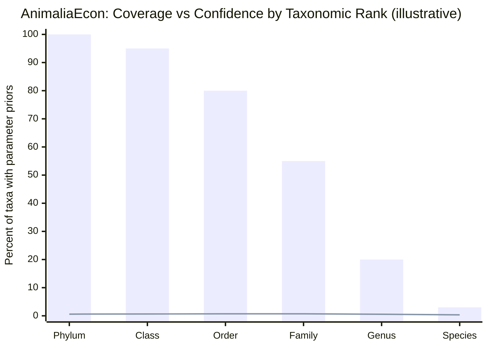

# AnimaliaEcon Prior-Art Review and a Defensible “First in the World” Claim

## Executive summary

A broad claim like **“the first economic‑behavioral dataset across Animalia”** is **not** defensible as stated, because there are already **very large, cross‑taxon trait repositories** that include *behavioral/ecological attributes* (e.g., EOL’s TraitBank across the tree of life) and cross‑animal trait hubs (e.g., Open Traits Network metadata surfaced via ZooTraits).citeturn17view2turn17view1turn6view3

The **defensible “first”** lives in a narrower, technical wedge: **economic‑game parameterization + hierarchical inference + uncertainty + openness/reproducibility**. Existing resources either (a) aggregate *traits* rather than *economic-game parameters*, (b) cover only major clades (birds/mammals/fish/amphibians), or (c) are literature reviews and scattered experiments without a standardized cross‑taxon dataset.citeturn17view1turn17view0turn18view1turn18view0

**Recommended one-sentence claim (accurate + plausibly unique):**  
**“AnimaliaEcon is the first open, machine‑readable dataset and reproducible pipeline that translates cross‑species biology into economic‑game‑ready parameter priors across the animal tree of life, using taxonomic hierarchical inference with uncertainty quantification.”**citeturn17view2turn17view1turn17view0turn14view1

That statement is *still ambitious*, but it is materially harder for prior art to match, because it claims a **specific product category** (economic-game parameter priors) plus a **specific method** (hierarchical inference + uncertainty) and **specific engineering properties** (open + machine‑readable + reproducible).citeturn17view1turn19view0turn14view1turn18view1

## Survey of existing datasets and closest prior art

The relevant prior art clusters into three buckets:

1) **Trait and biodiversity databases**: huge scale, broad taxonomic scope; mostly not “economic” in the experimental‑economics sense (risk/time preferences, bargaining, public goods payoffs), but they *do* include life history/ecology/behavior descriptors with varying structure/quality.citeturn17view2turn17view1turn6view3  
2) **Clade‑specific trait datasets** (birds, mammals, fish, amphibians, amniotes): high quality and well cited, but *not* across Animalia and generally not built for economic-game parameterization.citeturn14view3turn7view0turn19view0turn6view2turn20search4  
3) **Comparative / animal behavioral economics research**: lots of experiments and reviews, but mostly scattered across species and paradigms; not a unified species×parameter dataset.citeturn18view1turn18view2turn18view3turn18view4turn27view6  

### Comparison table of closest works

| Closest prior work | Scope & scale | What is parameterized | Method & machine-readability | Why it is **not equivalent** to “economic‑behavioral across Animalia” |
|---|---|---|---|---|
| **entity["organization","Encyclopedia of Life TraitBank","trait repository | eol, global"]** | Trait repository “across the tree of life”; published structured data program ongoing since 2014citeturn17view2turn17view1 | Organism attributes incl. morphology, life history, habitat, interactions; includes “Life History and Behavior” category mapping in its ontology workflowciteturn17view1 | Modeled as a Neo4j property graph; data services; imports via Darwin Core Archive/connectors; (as of 2015 in the paper) ~11M records, >300 attributes, ~1.7M taxaciteturn17view2turn17view1 | It is a **trait bank**, not an **economic‑game parameter** dataset; “economic” variables (risk/time/inequity/effort elasticities) are not the native output.citeturn17view2turn17view1 |
| **entity["organization","Open Traits Network","trait data community | global"]** + ZooTraits | Metadata hub across many animal phyla; ZooTraits reports access/coverage summaries for tens of thousands of species (as metadata + some open raw datasets)citeturn6view3turn17view0 | Trait records across animal ecology; not specifically economic behaviorciteturn17view0 | ZooTraits explicitly positions itself as **metadata aggregator**, not a full raw-data aggregator; Open Traits provides trait names + links rather than always raw trait valuesciteturn17view0 | Not a unified, machine‑readable **species×economic‑parameter** matrix; also not designed for “economic games” translation.citeturn17view0 |
| **PanTHERIA** (mammals) | Mammals: species-level life history/ecology/geography compilation (global mammal clade focus)citeturn7view0turn27view4 | Life history/ecology; not experimental‑econ parametersciteturn7view0 | Literature-derived compilation; species-level tables; built for macroecologyciteturn7view0 | Clade‑limited (mammals), and not an econ‑game parameterization.citeturn7view0 |
| **EltonTraits 1.0** (birds + mammals) | ~9,993 bird + ~5,400 mammal species; global foraging attributes; includes taxonomy-based interpolation for missing valuesciteturn9view1turn10search7 | Diet, foraging strata, activity time, body size; “Eltonian niche” traitsciteturn9view1 | Species-level compilation; flags missing + provides interpolated values based on taxonomyciteturn9view1 | Still “ecology traits,” not an econ‑game parameter layer; clade coverage is vertebrate‑heavy.citeturn9view1 |
| **AVONET** (all birds) | All birds: functional trait data for 11,009 species with raw measurements from 90,020 individuals; summarized in multiple taxonomic formatsciteturn14view3 | Morphological + some ecological variables; range size/locationciteturn14view3 | Dataset designed for macroecology/trait evolution; open access via CC BY noted in repository recordciteturn11view1 | Single class (Aves); traits are not translated into economic-game parameters.citeturn14view3 |
| **Amniote life-history database** | Birds+mammals+reptiles: up to 29 life-history parameters; ≥1 parameter for 21,322 species; includes name-resolution and a data-sharing algorithm for taxonomic transformationsciteturn19view0turn19view1 | Life-history parameters (pace of life etc.)citeturn19view0 | Consolidation/normalization across sources; taxonomic reconciliation workflow describedciteturn19view0 | Still not Animalia-wide; not economic-game parameterization.citeturn19view0 |
| **AmphiBIO** | Amphibians: 6,775 species; 17 traits; assembled from >1,500 sources; double-checked protocolciteturn6view2 | Natural history traits (ecology/morphology/reproduction)citeturn6view2 | Open Scientific Data release with explicit curation protocolsciteturn6view2 | Clade limited; not an econ‑behavior dataset.citeturn6view2 |
| **FishBase / SeaLifeBase** | FishBase covers >35,000 fish species (broad biology/ecology tables); SeaLifeBase targets non-finfish aquatic life; R tooling (rfishbase) exposes 30k+ fish species tables and experimental access to SeaLifeBase with ~200k species recordsciteturn20search4turn27view9turn27view10 | Biology/ecology/population dynamics/trophic ecology; not game parametersciteturn27view9turn20search4 | Machine access via APIs/tools; SeaLifeBase explicitly sets long-term objective of completing ~200,000 marine speciesciteturn27view9turn27view10 | Aquatic focus; trait/biology tables, not standardized economic-game parameter priors across Animalia.citeturn27view9turn20search4 |
| **Animal Culture Database** | Initial release: data from 121 papers; 61 species (30 mammals, 30 birds, 1 insect); explicitly documents taxonomic/geographic research bias and non-expert coding as a limitationciteturn28view0 | Culturally transmitted behaviors (qualitative + coded) rather than econ-game parametersciteturn28view0 | SQLite + CSVs; open data + GitHub release describedciteturn28view0 | Behavior-focused, but small scale and not “economic-game parameterization across Animalia”; explicitly acknowledges bias/coverage limits.citeturn28view0 |

**Bottom line from the table:** You will have trouble claiming “first dataset documenting every species in Animalia” in any behavior/trait sense, because multiple projects already do **cross‑species trait documentation** at huge scale (TraitBank) or across large clades (AVONET, EltonTraits, FishBase).citeturn17view1turn14view3turn9view1turn20search4  
But you have a credible opening to claim “first” in the narrower class: **economic‑game‑ready behavioral parameter priors across taxa, with hierarchical inference + uncertainty, released as an open dataset/pipeline.**citeturn18view1turn18view3turn19view0turn17view1

## What major biodiversity/taxonomic sources actually provide

### Global taxonomic backbones are strong on names, weak on behavior

A practical “cover every species” pipeline needs a canonical species list + stable identifiers. Two commonly used backbones (among others) are the **Catalogue of Life** and the **Open Tree of Life reference taxonomy**. The Catalogue of Life Base Release (Feb 2026) reports ~2.24M species, and the eXtended Release ~2.51M species; it also offers multiple download formats (ColDP, Darwin Core Archive, TextTree).citeturn14view1turn14view0 The Open Tree taxonomy release 3.7.3 reports ~4.53M OTT identifiers (“taxa”) with millions of synonyms and provides downloadable TSVs (taxonomy.tsv, synonyms.tsv, etc.).citeturn15view1

These taxonomic backbones are exactly what you want for **hierarchical inference structure** (phylum→class→order→family→genus→species), but they do not themselves provide the behavioral variables you want to model economically.citeturn14view1turn15view1

### Occurrence aggregators are not trait/econ databases

The **Global Biodiversity Information Facility (GBIF)** is optimized for occurrence records and download formats (Simple, Darwin Core Archive, Species List) rather than for rich behavioral trait matrices. Its download documentation emphasizes occurrence interpretations and Darwin Core compliance.citeturn16view3

### A conservation assessment database has limited “behavioral traits” and is gated

The **IUCN Red List** is a major source for conservation status and associated assessment fields (range, population, habitat/ecology, use/trade, threats, actions).citeturn12search3turn12search4 Programmatic access exists via an API that requires authentication; community tooling (e.g., R clients) is built around those routes.citeturn12search4turn12search21  
This is useful for “environmental context variables” (human pressure proxies), but it is not a repository of economic-game behavior parameters, and coverage/fields vary greatly by taxon.citeturn12search3turn12search4

### Encyclopedia-style resources are rich narratively but not “values for all species”

The **Animal Diversity Web** is explicitly an educational, structured database; it also warns it does not cover all species and cannot guarantee inclusion of the latest info.citeturn12search5 It exposes an internal query/report tool (Quaardvark) for database exploration (with download requiring registration).citeturn16view2turn12search5  
This is great for qualitative grounding and feature ideas, but not a clean, machine‑readable “every species × numeric economic trait” dataset at Animalia scale.citeturn12search5turn16view2

### The closest thing to “traits across life” is TraitBank, but it’s still not econ-game parameters

TraitBank is explicitly positioned as EOL’s structured-data layer, with search/browse/download and data services; it is modeled as a property graph in Neo4j.citeturn17view2turn17view1 The TraitBank paper describes large-scale ingestion via Darwin Core Archive/connectors and notes that TraitBank categories cover “Life History and Behavior” among other areas.citeturn17view1  
This is the strongest warning sign against an unqualified “first trait/behavior dataset across Animalia” claim—but it simultaneously supports your “translation layer” framing (traits → economic parameters).citeturn17view1turn17view2

## Feasibility of full-species coverage vs a hierarchical approach

### The scale problem is not compute, it’s epistemics

Even if you accept the Catalogue of Life Base Release count (~2.24M species) as your working universe, that’s millions of species-level rows.citeturn14view1turn14view0 The bigger constraint is: **behavioral/economic measurements simply do not exist for the vast majority of species**, and where they exist, they are often incomparable (different tasks, payoffs, deprivation states, lab contexts, etc.). This is a known issue even within narrower “animal economics” research: across species, tasks and contexts vary and generalization is hard.citeturn18view4turn18view3turn18view2

### Trait datasets show what “maximum feasible coverage” looks like—and it’s still uneven

Trait compilation projects repeatedly emphasize (explicitly or implicitly) the gap between what’s desired and what’s observed:

- ZooTraits notes many datasets have limited scope and that raw data can be difficult to access; ZooTraits positions itself as metadata aggregation rather than full raw-data hosting.citeturn17view0  
- The Animal Culture Database’s own limitations section highlights taxonomic bias and that early coding is not by taxonomic experts (a rare, explicit admission you can use as a cautionary template).citeturn28view0  
- “Complete coverage” successes are typically restricted to **specific clades** with long research traditions (all birds: AVONET; birds+mammals: EltonTraits; fishes: FishBase).citeturn14view3turn9view1turn20search4  

### A credible strategy is hierarchical coverage with uncertainty, not fake precision

A defensible Animalia‑wide dataset should treat species-level values as **posterior distributions** (priors + uncertainty) rather than as “true scores.” This matches (a) how TraitBank handles multi-source, semantic-normalized traits at scale and (b) how clade trait datasets sometimes already handle missingness via taxonomic interpolation (EltonTraits) or taxonomic reconciliation algorithms (Amniote database).citeturn17view1turn9view1turn19view0

### Key epistemic risks you should name explicitly

If you want the README / abstract to withstand scrutiny, you should pre-commit to these risks:

- **Construct validity risk:** “economic behavior” in an experimental task may not map cleanly onto ecological behavior (e.g., lab risk tasks vs natural foraging risk).citeturn18view4turn18view3  
- **Comparability risk:** Different paradigms define risk differently (variance/uncertainty; gains vs losses; reward modality).citeturn18view4turn18view3  
- **Sampling bias risk:** Behavioral datasets skew toward charismatic/model organisms (e.g., primates, rodents, pigeons). This is explicitly observed in the Animal Culture Database (bias and coverage limits) and is typical across behavior research.citeturn28view0turn18view2  
- **Taxonomy drift risk:** Species names/splits/merges evolve; you need name-resolution and synonym handling as a first-class component (Open Tree synonyms TSV; Amniote database name transformation tables).citeturn15view1turn19view0  
- **Imputation overreach risk:** “Values for every species” is easy to generate but hard to defend; you must separate observed vs inferred values and report uncertainty bands.citeturn9view1turn19view0  

## A defensible “first-in-the-world” framing

### What is unique enough to claim “first” without colliding with TraitBank/ZooTraits?

Based on prior art, you should **not** claim:
- “first behavioral dataset across Animalia” (TraitBank and others exist),citeturn17view1turn17view2  
- “first trait dataset across Animalia” (multiple trait hubs and clade-wide datasets exist),citeturn17view0turn14view3turn20search4  
- “first dataset documenting every species in Animalia” (taxonomic universe alone is disputed and constantly updated; and raw behavioral values are missing).citeturn14view1turn15view1  

You *can* plausibly claim “first” in the category:
- **economic-game-ready parameter priors** (not raw ecology traits),  
- **across Animalia via hierarchical inference**,  
- **with uncertainty outputs**,  
- **open + machine-readable + reproducible pipeline**.

This combination is not what TraitBank, FishBase, AVONET, EltonTraits, PanTHERIA, AmphiBIO, or the Animal Culture Database is architected to provide as its primary deliverable.citeturn17view1turn27view9turn14view3turn9view1turn7view0turn6view2turn28view0

### Recommended one-sentence project title/claim

**Title:** **AnimaliaEcon: Economic‑Game Priors Across the Animal Tree of Life**  

**One-sentence claim:**  
**“AnimaliaEcon is the first open, machine‑readable dataset and reproducible pipeline that maps animal taxa to economic‑game parameter priors (with uncertainty) by combining biodiversity trait repositories with taxonomic hierarchical inference.”**citeturn17view2turn17view1turn14view1turn19view0turn9view1

If you want an even safer variant that still feels “first” but reduces legalistic risk, add a scope delimiter:

**“...across Animalia *at hierarchical coverage*, with species-level priors where inferable.”**citeturn14view1turn15view1turn9view1

## Recommended parameter schema and inference method

### Parameter schema: 7 econ-relevant traits (game-ready)

These are designed so that (a) they correspond to canonical economic-game constructs, (b) some have known cross-species experimental traditions (risk, time discounting, demand/effort), and (c) they can be weakly informed by life-history/ecology proxies when direct data are missing.

1) **Risk preference (utility curvature / risk sensitivity)**  
   Justification: cross-species differences in risk preferences are documented in nonhuman animals; tasks manipulate reward amount and probability.citeturn18view4

2) **Temporal discount rate (k) / patience**  
   Discounting across species is a major comparative literature and is often fit by hyperboloid functions.citeturn18view3

3) **Effort price elasticity / labor-leisure tradeoff sensitivity**  
   Token economy / animal models exist in experimental economics and operant frameworks (conceptually closest to “demand curves”).citeturn18view1turn27view7

4) **Cooperation propensity in repeated social dilemmas**  
   Economic-game paradigms (Assurance, Hawk–Dove, Prisoner’s Dilemma) are used in primates and other taxa; your dataset can encode a standardized “cooperate rate” or equilibrium proximity.citeturn18view0turn27view6

5) **Inequity / fairness sensitivity**  
   This is a widely discussed comparative economics construct in primates and links naturally to many existing token exchange paradigms (even if you don’t collect all yourself).citeturn22view2turn18view2

6) **Punishment / retaliation propensity (costly sanctioning)**  
   Useful for public-goods and norm-enforcement simulation families (even if most nonhuman evidence is sparse, this can remain high-uncertainty outside a few clades).citeturn18view2turn18view0

7) **Exchange abstraction / tokenization capacity**  
   Treat as “ability to use/learn conditioned reinforcers or token exchange rules.” This is central to comparative animal economic behavior and has a long behavioral literature.citeturn18view1turn3search2turn22view2

### Hierarchical inference method with uncertainty quantification

A clean and defensible approach is **hierarchical Bayesian partial pooling** over the taxonomic tree:

- **Backbone:** use a canonical taxonomy (e.g., Catalogue of Life / Open Tree IDs) with synonym tables.citeturn14view1turn15view1  
- **Observation layer:** ingest direct measurements from literature / curated datasets (very sparse; mostly primates/rodents/birds/fish).citeturn18view3turn18view4turn18view0turn18view1  
- **Trait-proxy layer:** pull mechanistic/ecological correlates from existing trait repositories (body size, metabolic rate, diet breadth, social structure proxies, etc.) when available (TraitBank; AnimalTraits; clade trait datasets).citeturn17view1turn6view1turn14view3turn9view1  
- **Model:** for each parameter θ (e.g., risk curvature), estimate  
  - global mean + taxonomic random effects (phylum/class/order/family/genus),  
  - optional covariate effects from traits (allometry, lifespan proxies),  
  - measurement noise per study/task,  
  - posterior predictive distribution for each species.  
- **Output:** publish, for every taxon, a posterior mean + credible interval + provenance tags (`observed`, `imputed_taxonomy`, `imputed_trait`, `unknown`).  
This mirrors the reality that some datasets already interpolate by taxonomy (EltonTraits) and that large compilations require aggressive standardization and reconciliation (Amniote database).citeturn9view1turn19view0

### Mermaid inference flowchart (README-ready)

```mermaid
flowchart TD
  A[Taxonomy backbone\n(Catalogue of Life / Open Tree IDs)] --> B[Canonical taxon graph\n+ synonyms + splits/merges]
  C[Trait sources\n(TraitBank, clade trait datasets,\nFishBase/SeaLifeBase, AnimalTraits...)] --> D[Normalize traits\nunits + semantics + provenance]
  E[Economic-behavior literature\n(risk, discounting, effort, games)] --> F[Task harmonization\nmap tasks -> common parameters]
  B --> G[Hierarchical inference\npartial pooling over taxonomy]
  D --> G
  F --> G
  G --> H[Taxon-level priors + uncertainty\n(mean, CI, evidence type)]
  H --> I[Simulation interface\n(economic games / ABMs)]
  H --> J[Dataset release\nCSV/Parquet + docs + examples]
```

### Example chart: coverage vs confidence (illustrative)

This is the key idea you should communicate in one figure: **coverage rises as you move up ranks; confidence generally falls as you push down to species without direct evidence.** The numbers below are illustrative; you would replace with your real coverage metrics after v1.



A simple reporting format that matches the chart:

- **Coverage**: % of taxa with at least one prior for each parameter, by rank.  
- **Confidence**: median posterior entropy (or 1 − normalized variance), by rank.  
- **Evidence mix**: share of `observed` vs `imputed_taxonomy` vs `imputed_trait`.  

This aligns with how successful large datasets explicitly acknowledge missingness and bias (e.g., Animal Culture Database limitations; ZooTraits scope).citeturn28view0turn17view0

## Minimal credible v1 dataset and GitHub deliverables

### Minimal credible v1: 50–200 species that make your project “real”

For v1, the goal is not breadth-for-its-own-sake; it’s to create a **high-quality seed set** with (a) broad phylogenetic spread, (b) at least some direct behavioral-econ evidence traditions (risk/time/effort/game-like tasks), and (c) strong trait metadata availability from existing sources.

A defensible v1 strategy is “**well-studied exemplars across major branches**,” not “represent every species.” This mirrors how even a behavior-focused database like Animal Culture Database launched with 61 species and explicitly noted bias/coverage constraints.citeturn28view0

**Recommended v1 target:** ~120 species total, roughly:
- 40 mammals (primates + rodents + carnivores + social mammals),
- 30 birds (corvids + parrots + pigeons + passerines),
- 15 fishes (model fish + key foraging ecotypes; leverage FishBase tables),citeturn27view9turn20search4  
- 10 cephalopods/crustaceans,
- 25 insects/arthropods (ants, bees, drosophila, etc.).

This fits the ecological reality that “complete” trait coverage tends to exist mainly within flagship clades (birds, fishes, mammals).citeturn14view3turn20search4turn9view1

**Suggested seed list (illustrative, not exhaustive):**  
Pick 5–10 per group first; then scale to 120 once pipelines work.

- Primates: chimpanzee, bonobo, rhesus macaque, long‑tailed macaque, capuchin (Sapajus/Cebus), squirrel monkey.citeturn18view0turn22view2  
- Rodents: Norway rat, house mouse, prairie vole, capybara (optional).citeturn18view4turn18view3  
- Birds: pigeon, European starling, common raven, New Caledonian crow, kea.citeturn18view3turn14view3  
- Fish: zebrafish, guppy, stickleback (plus use FishBase for trait context like trophic ecology).citeturn20search3turn20search4  
- Cephalopods/crustaceans: common octopus, cuttlefish; crayfish (as welfare/cognition often studied in decision contexts).citeturn18view3turn18view4  
- Insects: honey bee, bumblebee, a leafcutter ant, fruit fly.citeturn28view0turn18view4  

(You would finalize this list by verifying which species actually have measurable risk/discounting/effort/game paradigms in the literature you can parse in a standardized way—this is an expert-curation bottleneck, not a compute bottleneck.)citeturn18view2turn18view3turn18view4

### Repo deliverables that make the project “publication-grade”

A strong GitHub v1 should mirror best practices in large trait/behavior databases: explicit provenance, standardization rules, and reproducible workflows (TraitBank import pipeline; Amniote reconciliation; ZooTraits transparency about what is/isn’t aggregated).citeturn17view1turn19view0turn17view0

Recommended structure:

- `data/`
  - `taxonomy_backbone.parquet` (IDs, ranks, synonyms, source version)
  - `species_seed.csv` (the 50–200 v1 set; stable IDs)
  - `economic_params_observed.csv` (raw observations; one row per study/condition)
  - `economic_params_posterior.csv` (species/taxon priors: mean, CI, evidence type)
- `schema/`
  - `economic_param_schema.json` (definitions, units, allowed ranges)
  - `task_harmonization.md` (how each paradigm maps to each parameter)
- `pipeline/`
  - `ingest_traits.py` (TraitBank/FishBase/AVONET/EltonTraits connectors)
  - `ingest_econ_lit.py` (curation scaffolding + extraction templates)
  - `fit_hierarchical_model.py` (Bayesian model; deterministic seeds)
- `docs/`
  - `METHODS.md` (epistemic limits + uncertainty semantics)
  - `DATA_PROVENANCE.md` (citations per data point)
  - `LIMITATIONS.md` (explicit bias statements; model misspecification risks)
- `examples/`
  - `simulate_public_goods.ipynb` (or script) using parameter priors
  - `simulate_risk_tasks.ipynb`
- `demo/`
  - tiny web dashboard: “pick a taxon → view posterior distributions + evidence”

## Prioritized sources and gaps requiring expert curation

### Highest-value primary sources to build on

- **Trait repositories / trait infrastructure**
  - TraitBank overview + architecture (Neo4j graph, data services).citeturn17view2turn17view1  
  - ZooTraits / Open Traits Network scope and its explicit distinction between metadata vs raw data aggregation (important for your licensing/provenance plan).citeturn17view0turn6view3  

- **Clade-scale trait datasets (for priors + covariates)**
  - Birds: AVONET (all birds; scale and taxonomic formats).citeturn14view3  
  - Birds + mammals: EltonTraits (diet/foraging; includes taxonomy-based interpolation concept you can mirror).citeturn9view1  
  - Mammals: PanTHERIA (life history/ecology/geography).citeturn7view0  
  - Amniotes: Amniote life-history database (taxonomic reconciliation workflows).citeturn19view0  
  - Amphibians: AmphiBIO (curation protocol and scale).citeturn6view2  
  - Fish/aquatic: FishBase + SeaLifeBase access via rfishbase; FishBase scale at >35k species.citeturn20search4turn27view9turn27view10  

- **Behavioral economics / comparative econ foundations**
  - Token economy / animal models framing in experimental economics (bridges economics↔animal behavior).citeturn18view1  
  - Cross-species delay discounting review (core intertemporal preference parameterization).citeturn18view3  
  - Cross-species risk preference review (core risk parameterization; emphasizes cross-species variability).citeturn18view4  
  - Economic games in nonhuman primates (evidence that economic-game paradigms exist and can be compared).citeturn18view0turn22view2  

### Gaps that likely require expert curation (call them out up front)

- **Task harmonization across species** is the biggest scientific gap: the same “risk” construct may be elicited with different reward modalities, deprivation states, horizons, and payoff structures.citeturn18view4turn18view3  
- **Sparse data outside vertebrates**: even behavior-forward databases report strong class biases and difficulty finding wild-population evidence for many invertebrates.citeturn28view0  
- **Licensing/provenance complexity**: many trait datasets are open, but some are not; ZooTraits notes embargo and licensing barriers explicitly.citeturn17view0  
- **Taxonomic maintenance**: you need versioned backbone snapshots and synonym handling (Open Tree provides synonyms TSV; Catalogue of Life versions are explicit and downloadable).citeturn15view1turn14view1  

**Net assessment:** The “first ___ in the world” claim is defensible if—and only if—you define your novelty as a **new translation layer**: *traits + sparse economic-behavior experiments → economic-game parameter priors across Animalia via hierarchical inference + uncertainty*, released openly with reproducible code. That is meaningfully different from existing trait banks and clade datasets, and it is a clear research contribution rather than a marketing slogan.citeturn17view1turn18view1turn19view0turn17view0